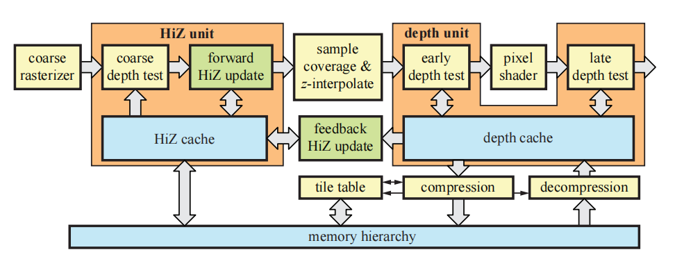
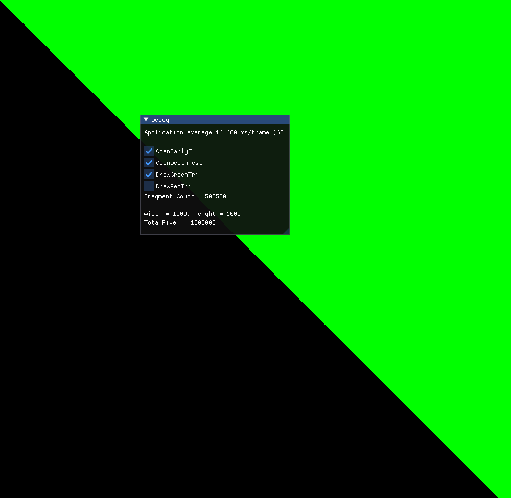
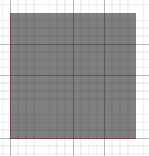
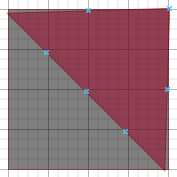
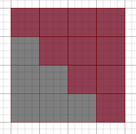
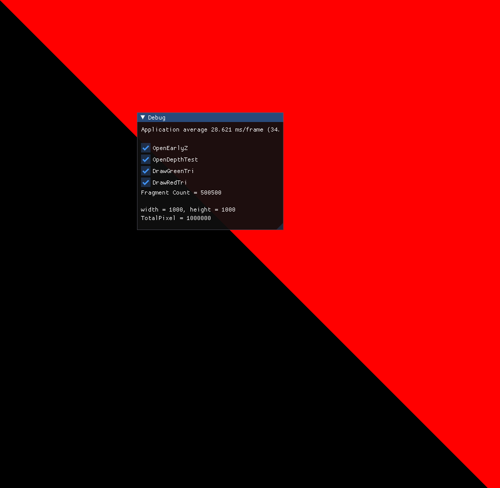

# 窥视PC的Earlyz

## 前言

移动端的TBDR架构有很多文章讲，hsr的过程在WWDC也有讲到，[链接](https://developer.apple.com/videos/play/wwdc2020/10602/)在这里，5分07秒开始。那么PC的EarlyZ是怎么做的呢？RTRT4是如下图描述的，那么有什么办法窥视PC的Earlyz呢？



## 如何开启earlyz？

如下关键词 early_frament_tests 来强制开启earlyz
```cpp
#version 430
out vec4 FragColor;
layout(early_fragment_tests) in;
void main()
{
}
```

## 如何判断是否存在earlyz呢？

首先想到是计算片元着色器的执行次数，那么用opengl的uniform atomic_uint可以原子递增，这样就可以计算片元着色器的执行次数。
```cpp
layout(binding = 0, offset = 0) uniform atomic_uint counter;
void main()
{
    atomicCounterIncrement(counter);
    FragColor = vec4(ourColor, 1.0);
}
```

### 具体绘制过程

窗口大小是1000x1000 总共1000000个像素
1、开启earlyz 开启深度测试
2、绘制近处的红色三角形（500000）

3、绘制远处的绿色三角形（500000）

4、红绿三角形重叠一共是1000000次片元着色器执行次数
5、实际是500500次片元着色器执行次数:
举例说明：
（5.1）下面黑色部分是屏幕 4x4 16个像素

（5.2）绘制一个三角形

（5.3）光栅化这个三角形

所以是(4x4-4)/2+4 = 10个像素
那么(1000x1000-1000)/2+1000=500500


举例说明：


6、关闭earlyz则是1001000次片元着色器执行次数


